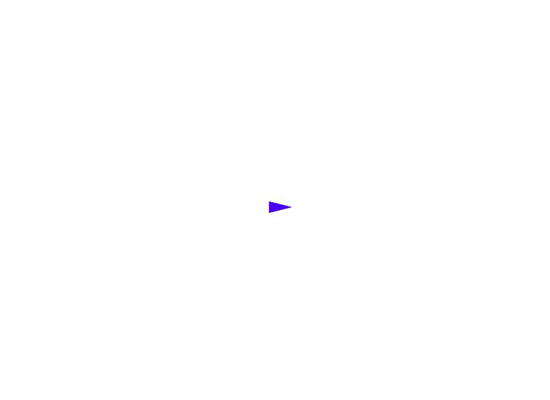
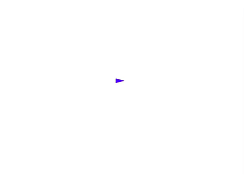

# Scenes and Entities

## 1. The Psyanim Scene and Psyanim Entity

A `Psyanim Scene` is an abstraction for the 2D world we are simulating.

A `Psyanim Entity` is an abstraction for anything that exists in a Psyanim Scene with a particular location, rotation, and (optionally) a visual representation which can have physics applied to it.

The `PsyanimScene` class acts as a container for `PsyanimEntity` objects.

Any object in your simulation that needs a position or orientation in the scene, a visual representation in the scene, or needs to have physics applied to it should be added to the scene as an entity.

To build a more intuitive feel for this, let's build a player controller from the ground up - we'll create a scene with an entity we can control via the keyboard.

## 2. Project Setup: Create your npm project and install psyanim-2

Let's start by opening a terminal (or powershell if that's your thing :) and creating a directory called `hello-psyanim-scenes`.

Navigate to the directory we just created and initialize an npm project with:

```bash
    npm init -y
```

Install psyanim-2 and psyanim-cli with:

```bash
    npm install git+https://github.com/thefinnlab/psyanim-2.git git+https://github.com/thefinnlab/psyanim-cli.git
```

Now, we can initialize our psyanim experiment with:

```bash
    npx psyanim-cli --init
```

## 3. Scene Setup: Create our scene where we will implement our player controller.

Let's go ahead and delete the `EmptyScene.js` under `./src/`.

We can create the new scene with the following command:

```bash
    npx psyanim-cli --scene PlayerControllerTestScene
```

Then, open up `index.js` in the `./src/` directory.

We won't need `jsPsych` here, so go ahead and delete everything in your index.js and we'll build it from scratch as an exercise.

Copy the following code into your `index.js` file:

```js
    import { PsyanimApp } from 'psyanim2';

    import PlayerControllerTestScene from './PlayerControllerTestScene';

    /**
     *  Setup Psyanim and PsyanimJsPsychPlugin
     */
    PsyanimApp.Instance.config.registerScene(PlayerControllerTestScene);

    PsyanimApp.Instance.run();
```

This is a minimal `Psyanim 2.0` application setup.  We basically register a single `PsyanimScene` type with the `PsyanimApp.Instance` and then call `run()` on it.

Let's open up our `PlayerControllerTestScene.js` under `./src/` and take a peek at its structure.  It should look like this:

```js
    import Phaser from 'phaser';

    import { PsyanimScene } from 'psyanim2';

    export default class PlayerControllerTestScene extends PsyanimScene {

        static KEY = 'PlayerControllerTestScene';

        constructor() {

            super(PlayerControllerTestScene.KEY);
        }

        init() {
            
            super.init();
        }

        preload() {
            
            super.preload();
        }

        create() {

            super.create();
        }

        update(t, dt) {

            super.update(t, dt);
        }
    }
```

We can go ahead and delete the `init()` and `preload()` methods for now, so we can focus on the two methods you'll most commonly use when creating new PsyanimScenes: `create()` and `update(t, dt)`.

The `constructor()` of our class is a good place to initialize anything that is not a PsyanimEntity or PsyanimComponent (e.g. POJO state data).

The `create()` method is called once every time a scene is loaded and this is where you'll want to do any work related to creating entities and components.

The `update(t, dt)` method is called every simulation frame (so 60 Hz since that's the default in Phaser) with the following arguments:

- `t`: current time in milliseconds
- `dt`: time since last frame was rendered in milliseconds

To see this in action, let's add the following line of code to our `create()` method after the `super.create()` call:

```js
    console.log('hello player controller!');
```

Open a couple of terminals.

In the first one, navigate to your project directory and run the following command to start a service that repackages your project into the `./dist/` directory anytime you save a code change:

```bash
    npm run watch
```

In the second one, run your http-server of choice to host the project locally.

Navigate to the url for your project in Google Chrome and you should see a blank page.

If you open up the Chrome Dev Tools and look at the `console` output, you should see `hello player controller!` printed out.

## 4. The Update() Method: Getting familiar with the `update(t, dt)` method: Adding keyboard controls.

To get familiar with the update() method, and also to learn how to process keyboard inputs, let's setup some keyboard inputs and print some messages in response to those keypresses at runtime.

At the end of your scene's `create()` method, add the following code:

```js
    // setup keyboard controls for this scene
    this._keys = {
        W: this.input.keyboard.addKey(Phaser.Input.Keyboard.KeyCodes.W),
        A: this.input.keyboard.addKey(Phaser.Input.Keyboard.KeyCodes.A),
        S: this.input.keyboard.addKey(Phaser.Input.Keyboard.KeyCodes.S),
        D: this.input.keyboard.addKey(Phaser.Input.Keyboard.KeyCodes.D)
    };
```

This code gives us a way to listen for the 'W', 'A', 'S', and 'D' keys specifically.

Next, in your `update(t, dt)` method, add the following code *after* `super.update(t, dt)`:

```js
    if (this._keys.W.isDown)
    {
        console.log("pressing the 'W' key!");
    }

    if (this._keys.S.isDown)
    {
        console.log("pressing the 'S' key!");
    }

    if (this._keys.A.isDown)
    {
        console.log("pressing the 'A' key!");
    }

    if (this._keys.D.isDown)
    {
        console.log("pressing the 'D' key!");
    }
```

Head back to your web browser and reload the app with Chrome Dev Tools open.

If you click on the canvas to give it focus, and then press any of the 'W', 'A', 'S', or 'D' keys, you should see the appropriate message get printed to the console for every frame that the key is held down.

Congratulations, you've learned how to process keyboard control input in real-time with just a few lines of code!

## 5. Player Entity: Creating an entity and adding it to the scene

Next, let's add a player character to the scene for us to control via the keyboard.

To do this, we'll need access to a `SHAPE_TYPE` constant that's defined in `PsyanimConstants`.

Let's update our `psyanim2` import statement to include `PsyanimConstants`:

```js
    import { 

        PsyanimScene,
        PsyanimConstants

    } from 'psyanim2';
```

Now we can add our 'player' entity to the scene by adding the following code to the end of our `create()` method:

```js
        // create 'player' entity in scene at center of canvas (400, 300)
        this._player = this.addEntity('player', 400, 300, {
            shapeType: PsyanimConstants.SHAPE_TYPE.TRIANGLE,
            base: 16, altitude: 32, 
            color: 0x0000ff
        });
```

Hop back on over to the Chrome browser and you should see your blue, triangle shaped 'player' entity in the scene!

<p align="center">
  
</p>

## 6. Player Controller: Making our entity move in response to keyboard controls

Next, let's get our 'player' entity moving around in response to the WASD keyboard controls.

To start, delete all the code we added to the `update(t, dt)` method and replace it with the following code:

```js
    // define translational and rotational speeds
    const speed = 8;
    const turnSpeed = 0.2;

    // get horizontal and vertical movement inputs
    let horizontal = (this._keys.A.isDown ? -1 : 0) + (this._keys.D.isDown ? 1 : 0);
    let vertical = (this._keys.W.isDown ? -1 : 0) + (this._keys.S.isDown ? 1 : 0);

    // compute velocity direction from keyboard inputs and set to desired speed
    let velocity = new Phaser.Math.Vector2(horizontal, vertical)
        .setLength(speed);

    // here we actually set the translational velocity of the 'player' entity:
    this._player.setVelocity(velocity.x, velocity.y);

    // next we will adjust our orientation based on our control input directions
    if (Math.abs(horizontal) > 1e-3 || Math.abs(vertical) > 1e-3)
    {
        const targetAngle = Math.atan2(vertical, horizontal);

        // we don't snap to the target angle immediately, instead we lerp smoothly to it
        let newAngle = Phaser.Math.Angle.RotateTo(
            this._player.angle * Math.PI / 180,
            targetAngle,
            turnSpeed);

        // here, we actually set the player's orientation based on the lerped value
        this._player.setAngle(newAngle * 180 / Math.PI);
    }
```

The code comments above explain the basic movement algorithm.

The `update(t, dt)` method is called each simulation frame (60 times per second).

In it, we check what buttons the player is pressing ('W', 'A', 'S', or 'D') and use that to create a direction vector for the player's velocity and desired orientation.

From that direction vector and the desired translational speed, we can set the 'player' entity's velocity directly.

We then update the player's orientation by lerping towards the direction vector's angle w/ respect to the horizontal.

There are many variations of movement algorithms used for character control, but most are fundamentally the same (maybe with a 3rd dimension to deal with).

When you have reached this point, your `PlayerControllerTestScene.js` file should look like the following:

```js
import Phaser from 'phaser';

import { 

    PsyanimScene,
    PsyanimConstants

} from 'psyanim2';

export default class PlayerControllerTestScene extends PsyanimScene {

    static KEY = 'PlayerControllerTestScene';

    constructor() {

        super(PlayerControllerTestScene.KEY);
    }

    create() {

        super.create();

        console.log('hello player controller!');

        // setup keyboard controls for this scene
        this._keys = {
            W: this.input.keyboard.addKey(Phaser.Input.Keyboard.KeyCodes.W),
            A: this.input.keyboard.addKey(Phaser.Input.Keyboard.KeyCodes.A),
            S: this.input.keyboard.addKey(Phaser.Input.Keyboard.KeyCodes.S),
            D: this.input.keyboard.addKey(Phaser.Input.Keyboard.KeyCodes.D)
        };

        // create 'player' entity in scene at center of canvas (400, 300)
        this._player = this.addEntity('player', 400, 300, {
            shapeType: PsyanimConstants.SHAPE_TYPE.TRIANGLE,
            base: 16, altitude: 32, 
            color: 0x0000ff
        });
    }

    update(t, dt) {

        super.update(t, dt);

        // define translational and rotational speeds
        const speed = 8;
        const turnSpeed = 0.2;

        // get horizontal and vertical movement inputs
        let horizontal = (this._keys.A.isDown ? -1 : 0) + (this._keys.D.isDown ? 1 : 0);
        let vertical = (this._keys.W.isDown ? -1 : 0) + (this._keys.S.isDown ? 1 : 0);

        // compute velocity direction from keyboard inputs and set to desired speed
        let velocity = new Phaser.Math.Vector2(horizontal, vertical)
            .setLength(speed);

        // here we actually set the translational velocity of the 'player' entity:
        this._player.setVelocity(velocity.x, velocity.y);

        // next we will adjust our orientation based on our control input directions
        if (Math.abs(horizontal) > 1e-3 || Math.abs(vertical) > 1e-3)
        {
            const targetAngle = Math.atan2(vertical, horizontal);

            // we don't snap to the target angle immediately... 
            // instead we lerp smoothly to it using Phaser's built-in 'RotateTo' method
            let newAngle = Phaser.Math.Angle.RotateTo(
                this._player.angle * Math.PI / 180,
                targetAngle,
                turnSpeed);

            // here, we actually set the player's orientation based on the lerped value
            this._player.setAngle(newAngle * 180 / Math.PI);
        }
    }
}
```

Hop back over to your web browser and you should be able to see your 'player' entity moving around nice and smooth in response to WASD keypresses!

<p align="center">
  
</p>

## 7. Summary of Scenes and Entities

In this tutorial, we created a barebones `Psyanim 2.0 application` with just a single `scene`.

In that scene, we added a single `entity` and then added code to make it move around in response to keyboard input.

Through this exercise, we saw how `entities` can be added to `scenes` and how we can control their `velocity` and `orientation` via methods called on the entity itself.

As we'll see in future tutorials, however, we can control more than just an entity's `velocity`.  We can control it's `position` directly as well as add individual `forces` or `accelerations` to the `entity`.

So, now that we've made this wonderful `player controller` for our 'player' entity, what happens if we created 10 more scenes with different types of player entities (circles, squares, different colors / sizes, etc.)?

Do we have to copy / paste all this code into those scenes too, or is there a more <ins>*convenient and reliable way*</ins> to reuse this logic for <ins>*any*</ins> entity in <ins>*any*</ins> scene?

It turns out there is! It's called a `Psyanim Component` and we'll learn more about that in the next tutorial.